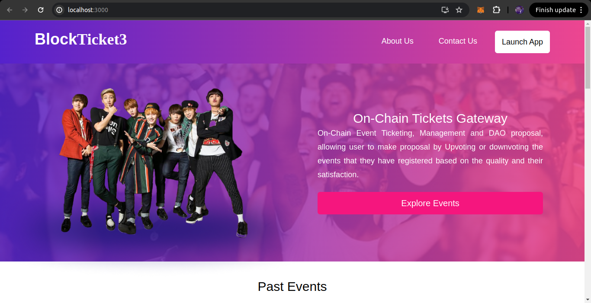
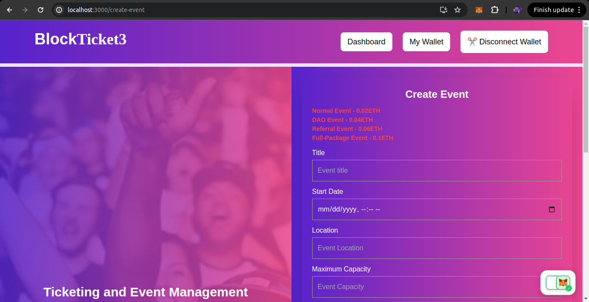
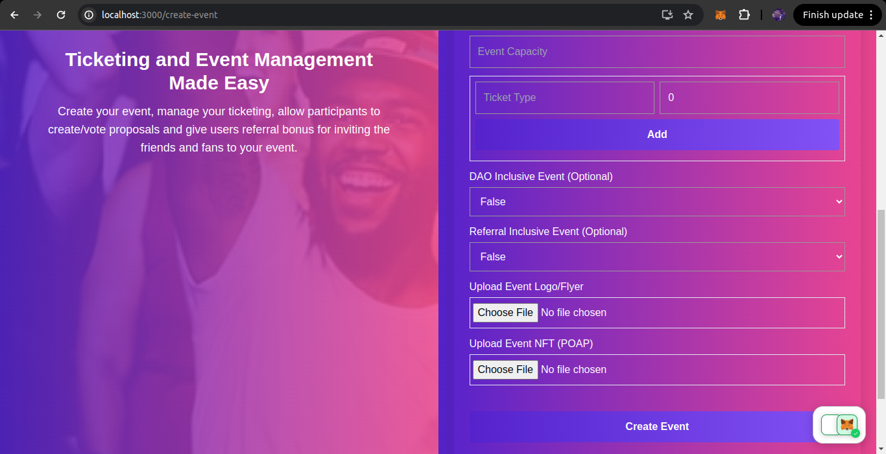
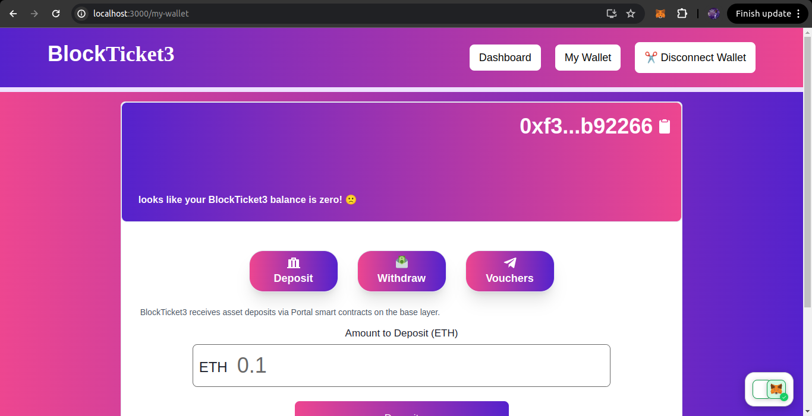
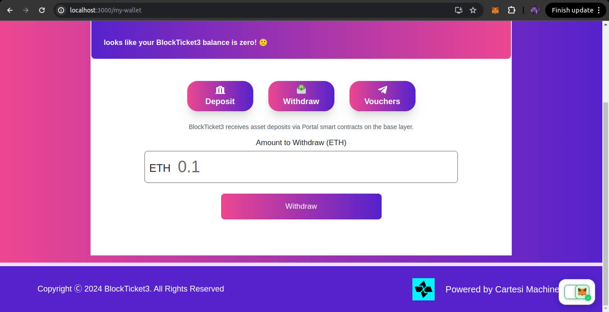

# Welcome to BlockTicket3

# Link to Notion for Setting up and testing locally
https://www.notion.so/BlockTicket3-f00c498945714e55a87f3d8bfd8e1051

BlockTicket3 harnesses Cartesi's unique features to address specific challenges associated with decentralized applications, particularly in the context of ticketing platforms and events management.

## Unique Features of BlockTicket3

- Create Event: This feature allows a user to create events and manage events ticketing
- Purchase Ticket: This feature allows users to purchase event ticket/s.
- DAO: The DAO feature will only allow users who successfully paid for an event to make proposals about the event and also to Up-Vote or Down-Vote a proposal
- Referral: This feature allows users to invite their friends to buy the event tickets and when the minimum number of referral is reached, such user can be able to purchase a ticket at a discount set by the event organizer.
- Refund: This feature allows users to easily get refunded and withdraw the amount paid for the ticket in the case that an event is canceled by the organizer.
- Mint NFT: This feature allows users to easily mint an NFT after an event has ended. The NFT serves as a proof of participation.

- 

### Creating an Event

The event organizer connects his/her wallet and then fill the form to create an event and manage ticketing on-chain. You can access the route through `“/create-event”`. There are checks to make sure you have enough assets in the DAPP to pay for event creation fee.

1. The Normal events are events that don’t have DAO and Referral Feature. This cost 0.02ETH.
2. The DAO events are events that do have DAO feature (Giving participants the power to participate in the event organizing). This cost 0.04ETH.
3. The Referral events are events that do have Referral Feature (event participants get referral codes to share with family and friends and get discounts when there get enough referrals). This cost 0.06ETH.
4. The Full Package events are events that do have DAO and Referral Feature. This cost 0.1ETH.

There are other details like event title, location, capacity, ticket categories, event logo and event POAP.

- 
- 

### Purchasing Event Ticket

After the creation of an event, users can proceed to buying of event tickets. The event organizer creates different categories of tickets with their names and cost in ETH. There are checks that you have enough balance to pay for a ticket, before even interacting with the cartesi machine.

### Starting an Event

For this action, Only an event creator/organizer can start an event.

### Ending an Event

For this action, Only an event creator/organizer can end an event. As soon as u end an event, the total ETH accumulated from the selling of your tickets is transferred to your DAPP Wallet and ready for you to withdraw.

### Canceling an Event

For this action, Only an event creator/organizer can cancel an event. After an event has been cancelled. Each participant can request for a refund of their ticket and get paid the full amount of their purchase fee.

### Creating and Voting of Proposal(s) (DAO)

If an event is either DAO inclusive or Full package event, participants can propose or suggest ideas or side events that the organizers can include the event routine. This proposal is tie to one vote per participant, i.e a participant cannot vote twice for a proposal.

### Referral Feature

Allows users to get discount for referring participants. There are checks to check that a referral code is valid for the selected event. Also as soon as a participant gets its discount for an event after a referral code has reached its minimum, such referral won’t bear a discount anymore. Also we have checks that participants don’t exceed the capacity of the event.

When buying a ticket, we check if any of your referral code has reached the minimum count, then we apply the discount.

### Withdrawing Ethers using Vouchers

You can always withdraw your Ethers Balance. You can access the route through `“/my-wallet”`.

- 
- 
